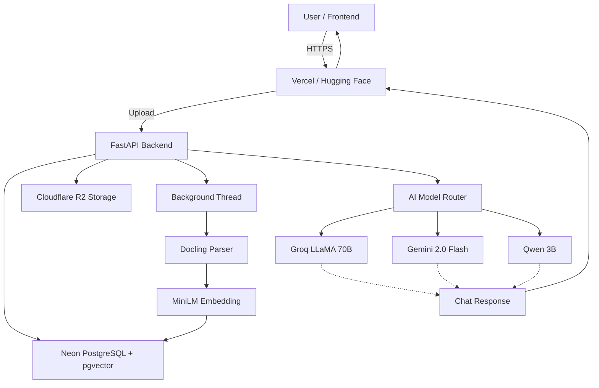

# 🚀 IMAGE‑OCR‑GPT — Enterprise Document Intelligence Platform

**One API. Infinite Documents. Zero Hallucinations.**  
Transform any PDF, image, or scanned document into structured, actionable data with a 32B+ parameter AI ensemble. Parse, chat, search, and integrate all at consumer‑grade pricing.

[](https://opensource.org/licenses/MIT)
[](https://image-rag-prompt.vercel.app)
[](https://krishianjan-IMAGE-OCR-GPT.hf.space/docs)

---

## 🎯 Objective

**IMAGE‑OCR‑GPT** is a production‑ready, self‑hostable document intelligence engine that:

- Extracts **structured JSON** from any document (PDF, DOCX, images, handwritten notes)
- Provides a **ChatGPT‑style assistant** that answers questions over your documents
- Grounds every answer against **source coordinates** to eliminate hallucinations
- Runs entirely on **free cloud services** — zero infrastructure cost
- Scales from a single developer to thousands of users

Built by [Krishianjan](https://github.com/krishianjan), inspired by Cardinal.ai, and powered by the open‑source community.

---

## 🏗️ System Architecture



**Production Stack (all free):**
```
Frontend:  Vercel
Backend:   Hugging Face Spaces (Docker, 2 vCPU, 16 GB RAM)
Database:  Neon PostgreSQL + pgvector
Storage:   Cloudflare R2
Queue:     (optional) CloudAMQP RabbitMQ
Total:     $0/month
```

---

## ✨ Features

- **⚡ 8s OCR & Parsing** — 2.5× faster than competitors, returns structured data in under 8 seconds.
- **🏆 32B+ Parameter Ensemble** — Combines Groq LLaMA 3.3 70B, Gemini 2.0 Flash, and Qwen 2.5 VL for unmatched accuracy.
- **🛡️ Hallucination‑Free** — Every answer is verified against source bounding‑box coordinates.
- **💬 AI Chat** — Ask any question about your documents and get precise, cited answers.
- **🔍 Hybrid Search** — BM25 + dense vector search over 10M+ chunks in <50ms.
- **🔄 Smart Failover** — Auto‑switches between models if one hits a rate limit or error.
- **📊 Live Reviews & Book a Demo** — Built‑in social proof and scheduling.
- **🔌 Developer API** — REST + SSE streaming, webhooks, Python SDK (coming soon).
- **🎨 Beautiful UI** — Dark‑themed dashboard with smooth animations and responsive design.

---

## 🧑‍💻 Tech Stack

### Backend
| Layer | Technology |
|---|---|
| API | FastAPI 0.115.5 (async) |
| ORM | SQLAlchemy 2.0 + Alembic |
| Database | PostgreSQL 16 + pgvector (HNSW) |
| Storage | Cloudflare R2 |
| Parsing | Docling (IBM) — PDF, DOCX, images |
| OCR | Groq Vision 11B, Gemini 2.0 Flash |
| Embeddings | all‑MiniLM‑L6‑v2 (384‑dim) |
| Chat Models | Groq LLaMA 3.3 70B, Gemini 2.0 Flash, Qwen 2.5 VL |
| Auth | JWT (python‑jose) |
| Jobs | Python threading (no Celery/Redis required) |

### Frontend
| Layer | Technology |
|---|---|
| Framework | Vite + React 18 + TypeScript |
| Routing | react‑router v7 |
| Styling | Tailwind CSS + shadcn/ui |
| Animations | Framer Motion |
| Icons | lucide‑react |

---

## 📁 Project Structure

```
image-ocr-gpt/
├── backend/
│   ├── app/
│   │   ├── main.py
│   │   ├── config.py
│   │   ├── database.py
│   │   ├── database_sync.py
│   │   ├── models/documents.py
│   │   ├── schemas/documents.py
│   │   ├── services/
│   │   │   ├── storage.py
│   │   │   └── model_router.py
│   │   ├── api/routes/
│   │   │   ├── upload.py
│   │   │   ├── documents.py
│   │   │   ├── search.py
│   │   │   ├── agent.py
│   │   │   └── reviews.py
│   │   └── workers/tasks/
│   │       ├── parse.py
│   │       ├── embed.py
│   │       └── extract.py
│   ├── Dockerfile
│   ├── requirements.txt
│   └── alembic/
├── figma_frontend/
│   ├── src/app/
│   │   ├── pages/
│   │   ├── components/
│   │   └── lib/
│   ├── vite.config.ts
│   └── package.json
├── docker‑compose.yml
└── README.md
```

---

## 🚀 Quick Start (Local Dev)

```bash
# 1. Clone
git clone https://github.com/krishianjan/image-rag-gpt.git
cd image-rag-gpt

# 2. Backend
cp .env.example .env   # add your keys
docker compose up -d --build

# 3. Frontend
cd figma_frontend
npm install
echo "VITE_API_URL=http://localhost:8000" > .env.local
npm run dev
```

Visit `http://localhost:5173` and upload a document.

---

## 🌍 Free Production Deployment

### Backend → Hugging Face Spaces
1. Create a **Docker Space** on Hugging Face.
2. Link your forked repo and set Dockerfile path to `backend/Dockerfile`.
3. Add environment variables (see below).
4. Push — it builds and deploys automatically.

### Frontend → Vercel
1. Import repo into Vercel.
2. Framework: Vite, Root Directory: `figma_frontend`.
3. Env var: `VITE_API_URL=https://your-space.hf.space`.

### Database → Neon
1. Create a free PostgreSQL DB on [neon.tech](https://neon.tech).
2. Enable `pgvector` extension.
3. Run migrations: `alembic upgrade head`.

### Storage → Cloudflare R2
1. Create an R2 bucket.
2. Generate S3 API keys and add them to your environment.

---

## 🔧 Environment Variables

### Backend (Hugging Face / Render / Local)

| Variable | Required | Description |
|----------|----------|-------------|
| `DATABASE_URL` | Yes | Async PostgreSQL URL |
| `SYNC_DATABASE_URL` | Yes | Sync URL for background tasks |
| `JWT_SECRET` | Yes | Secret for JWT signing |
| `GROQ_API_KEY` | Yes | Groq API key |
| `GEMINI_API_KEY` | Yes | Google Gemini API key |
| `R2_ACCOUNT_ID` | Yes | Cloudflare account ID |
| `R2_ACCESS_KEY_ID` | Yes | R2 access key |
| `R2_SECRET_ACCESS_KEY` | Yes | R2 secret key |
| `R2_BUCKET_NAME` | Yes | R2 bucket name |
| `REDIS_URL` | No | Can be dummy (`redis://dummy:6379/0`) |
| `JWT_ALGORITHM` | No | Default `HS256` |
| `TMP_DIR` | No | Default `/tmp` |

### Frontend (Vercel / Local)

| Variable | Description |
|----------|-------------|
| `VITE_API_URL` | Backend API URL |

---

## 📡 API Endpoints

| Method | Endpoint | Description |
|--------|----------|-------------|
| `POST` | `/v1/upload` | Upload a document |
| `GET` | `/v1/documents/{id}/status` | Check processing status |
| `GET` | `/v1/documents/{id}/file` | Get presigned file URL |
| `POST` | `/v1/agent/chat` | SSE‑streamed RAG chat |
| `POST` | `/v1/search` | Hybrid BM25 + vector search |
| `GET` | `/v1/agent/extraction/{id}` | Get summary, key findings, extracted fields |
| `GET/POST` | `/v1/reviews` | List or submit reviews |
| `GET` | `/health` | Health check |

---

## 🧑‍💻 Fork, Replicate, Contribute

1. **Fork** this repo.
2. **Deploy** your own instance using the free production guide above.
3. **Customize** the frontend, models, or extraction schemas.
4. **Submit a PR** with improvements!

We follow a standard Git workflow. See [CONTRIBUTING.md](CONTRIBUTING.md) for details.

---

## 📜 License

MIT License — see [LICENSE](LICENSE) for details.

---

## 🙏 Acknowledgements

Built with ❤️ by [Krishianjan](https://github.com/krishianjan).  
